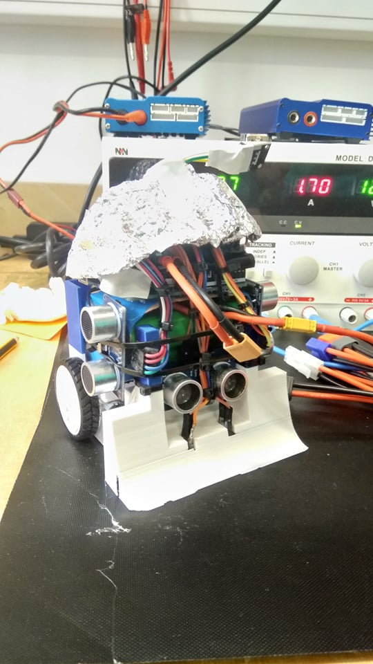
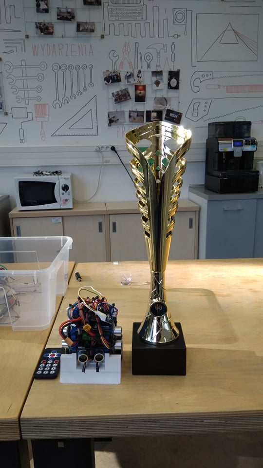

# sumo-bot
Minisumo project

# Overview
This repository holds all digital materials created for minisumo competition held on 2023-06-15 at the Faculty of Physics at the University of Warsaw. Final contraption won 1st place against 9 other teams.

# Team
* Łukasz Skrzyński (captain)
* Michał Szczerbakowicz
* Wojciech Knop
* Jan Gers

supervisor: Piotr Kaźmierczak

# Construction
Typical minisumo requirements applied: horizontal dimensions 10 by 10 cm, max mass 500 g, no sticking, no destroying dohyo and opponents, no sensor jamming. The first iteration was meant to utilize all parts in file `hardware/części\ v2.xlsx`. However, due to time constraints and damaged parts along the way, the project was simplified.

The final version consisted of
* 2 line sensors under the plow
* 3 sonic sensors
* 1 IR sensor + remote control for activation
* 1 Arduino Uno board (Arduino Leonardo fried three days before the competition)
* 1 Adafruit clone servo shield (DFRobot fried along with Leonardo)
* 2 motors + wheels

Line sensors had to be shortened to fit in the casing. Li-ion battery pack was provided by the contest holder, had a mass of ~300 g (excluded from mass requirement) and U max 12,6 V.

# Behavior
The behavior is controlled by a simple state machine inspired by Figure 3 on page 5 of [this document](http://www.ridgesoft.com/articles/minisumo/Building%20and%20Programming%20a%20Mini-Sumo.pdf). In a nutshell, the robot travels in a straight line looking for enemy and either bumps on a white line, in which case it turns away from it, or locks on an enemy, turning towards it and ramming it. Line sensors take precedence over sonic sensors as the appropriate action is executed via interrupt pins. Race conditions were negligible and hard to come by in real fight.

# Competition
The robot won all but one fight in group stage and won narrowly in the finale.

